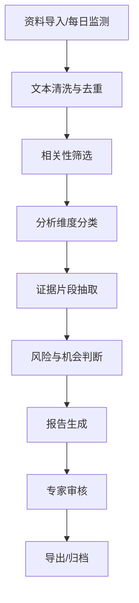

# 全球营商环境智能分析平台 Demo 开发需求文档

## 1. 项目定位

本项目处于预研与 demo 阶段，目标是验证“全球营商环境智能分析平台”的核心产品形态与技术可行性。平台面向企业出海、区域国别研究、政府/园区招商服务、跨境投资咨询等场景，自动汇聚每日公开资料或预置资料，对资料进行相关性筛选、结构化分析、证据溯源，并生成可由专家审核的国别营商环境智能分析报告。

当前 demo 不追求完整全球覆盖、真实生产级爬虫、复杂权限体系或正式上线部署。核心目标是做出一个可以演示的闭环：

1. 用户能进入一个专业的营商环境情报工作台。
2. 用户能看到每日监测资料、风险机会提示、国家/地区状态。
3. 系统能对资料进行分类、筛选、证据片段抽取。
4. 系统能按照区域国别专家报告框架生成一份结构化分析报告。
5. 报告中的关键判断能追溯到来源资料。
6. 用户能对报告进行人工审核、标记存疑、导出或复制。

一句话产品定义：

> 面向企业出海决策的全球营商环境智能分析工作台，将分散资料转化为可溯源、可审核、可导出的国别营商环境分析报告。

## 2. Demo 范围边界

### 2.1 Demo 必须完成

- 完成一个可运行的网站前端。
- 完成后端 API 或前端 mock service，保证页面数据闭环。
- 使用 mock 数据模拟每日爬取资料。
- 支持至少 3 个国家/地区示例，建议：
  - 巴西
  - 沙特阿拉伯
  - 阿联酋
- 支持至少 1 份完整的国别分析报告展示，优先以“巴西宏观经济与营商环境研究报告”的结构为参考。
- 展示资料筛选、维度分类、证据来源、报告生成、专家审核这些核心流程。
- 页面风格参考“中东营商环境与项目机会情报工作台”类产品：专业、克制、信息密度较高、适合业务人员和研究人员使用。

### 2.2 Demo 暂不要求

- 不要求真实爬虫稳定运行。
- 不要求接入真实生产数据库。
- 不要求真实用户登录和复杂权限。
- 不要求多租户、组织管理、计费系统。
- 不要求覆盖所有国家。
- 不要求真正生成 PDF/Word 文件，可先提供导出按钮和 mock 成功提示；如果时间允许，可实现 Markdown/HTML 导出。
- 不要求接入 LangChain 作为全局底座。

### 2.3 需要预留但不一定实现

- 预留 LLM/Agent API adapter，后期替换为实际项目提供的智能体 API。
- 预留真实爬虫/数据源接入接口。
- 预留向量检索或 RAG 模块。
- 预留专家审核记录与报告版本管理。
- 预留多语言资料处理能力。

### 2.4 建议加入的小型真实来源测试

为了避免 demo 完全停留在 mock 数据层面，建议加入一个“真实来源 smoke test”。该测试不追求大规模稳定爬虫，只用于验证真实网页/PDF 抓取、正文抽取、清洗、维度分类和报告生成链路是否可行。

建议范围：

- 选择 2-3 个国家。
- 每个国家选择 3-5 个权威来源页面或 PDF。
- 总量控制在 10-15 条真实资料。
- 真实资料与 mock 数据分开标记。
- 如果网站阻止抓取或结构复杂，可以允许手动导入 HTML/PDF 文件进行解析测试。

首批建议来源类型：

| 国家/地区 | 来源类型 | 示例来源 |
|---|---|---|
| 巴西 | 国际组织数据 | World Bank Brazil Data / World Bank Brazil Overview |
| 巴西 | 宏观经济与金融 | IMF Brazil country page / IMF Article IV / Brazil Central Bank Focus Market Readout |
| 巴西 | 贸易政策 | WTO Brazil Trade Policy Review |
| 沙特 | 投资与产业政策 | Ministry of Investment of Saudi Arabia / Invest Saudi |
| 沙特 | 国家战略 | Saudi Vision 2030 |
| 阿联酋 | 投资环境 | UAE Ministry of Economy & Tourism / Invest UAE |
| 阿联酋 | 宏观金融 | Central Bank of the UAE Research and Statistics / Quarterly Economic Review |

真实来源测试的目标不是“爬得越多越好”，而是回答四个问题：

1. 网页正文能否被稳定抽取？
2. PDF 能否被解析成可用文本？
3. 抽取出的文本能否被正确映射到营商环境维度？
4. 由真实资料生成的报告是否仍然有证据链和专家审核入口？

实现要求：

- 真实抓取模块必须有超时、错误提示和失败降级。
- 必须记录抓取状态：成功、失败、部分成功、手动导入。
- 必须保留原始 URL、抓取时间、文本抽取方式。
- 不要绕过网站访问限制，不要高频抓取。
- 对禁止抓取或反爬明显的网站，只做手动样本导入。

## 3. 用户角色

### 3.1 企业出海决策人员

关注某个国家近期政策、市场机会、营商风险和行动建议。需要快速看到结论和风险等级。

### 3.2 区域国别研究专家

关注资料来源、判断依据、分析框架是否合理。需要审核、修改和标记模型生成内容。

### 3.3 平台运营人员

关注资料是否正常采集、是否有低质量资料、报告是否生成成功。需要查看任务状态和数据质量。

### 3.4 项目演示对象

关注平台是否具备“资料汇聚 + 智能分析 + 报告生成 + 专家审核”的完整能力。需要直观看到产品价值。

## 4. 核心业务流程



Demo 中可以用 mock 数据模拟 A-B 阶段，重点实现 C-I 的可视化表达。

## 5. 信息架构

建议初版包含 5 个主页面。

### 5.1 工作台首页 `/`

目标：让用户一眼看到全球/区域营商环境监测概况。

核心模块：

- 顶部导航：
  - 工作台
  - 资料库
  - 智能筛选
  - 国别报告
  - 审核中心
- 今日概览指标：
  - 今日新增资料数
  - 高相关资料数
  - 高风险预警数
  - 已生成报告数
  - 待专家审核数
- 国家/地区卡片：
  - 国家名称
  - 风险等级：低/中/高/严重
  - 机会等级：低/中/高
  - 最新变化摘要
  - 重点行业
  - 报告状态
- 今日重点风险：
  - 政策风险
  - 汇率/金融风险
  - 贸易保护风险
  - 地缘政治风险
- 今日重点机会：
  - 产业政策机会
  - 进口替代机会
  - 基建/能源/医疗/数字经济等行业机会

视觉要求：

- 专业工作台风格，不做营销落地页。
- 信息密度适中，避免大幅空白。
- 使用清晰的卡片、表格、状态标签。
- 颜色克制，建议深绿、墨蓝、灰白、少量琥珀/红色风险提示。

### 5.2 资料库页面 `/sources`

目标：展示每日抓取或导入的资料。

字段建议：

| 字段 | 说明 |
|---|---|
| title | 资料标题 |
| source | 来源机构/网站 |
| country | 相关国家 |
| region | 地区 |
| language | 语言 |
| published_at | 发布时间 |
| collected_at | 采集时间 |
| source_type | 政府、国际组织、媒体、智库、企业公告、数据库 |
| reliability | 来源可信度，高/中/低 |
| relevance_score | 与营商环境相关性分数 |
| dimensions | 命中的分析维度 |
| summary | 资料摘要 |
| url | 原文链接 |

功能要求：

- 支持按国家、来源类型、风险维度、相关性、日期筛选。
- 支持搜索标题和摘要。
- 支持点击查看资料详情。
- 资料详情需要展示：
  - 原始摘要
  - 模型提取的关键事实
  - 命中的分析维度
  - 关联报告段落

### 5.3 智能筛选页面 `/screening`

目标：展示系统如何从每日资料中筛出真正有分析价值的信息。

核心模块：

- 待筛选资料列表。
- 相关性判断：
  - 高相关
  - 中相关
  - 低相关
  - 重复/噪声
- 判断理由：
  - 例如“涉及巴西税制改革，对外资企业经营成本有直接影响”。
- 维度映射：
  - 宏观经济
  - 产业政策
  - 贸易环境
  - 市场机会
  - 经营风险
  - 政治与地缘风险
  - 企业行动建议
- 证据片段：
  - 展示原文中支撑判断的 1-3 段短文本。
- 人工操作：
  - 采纳
  - 降权
  - 标记误判
  - 加入今日报告

重要要求：

- 不要只展示一个 AI 分数，要展示“为什么相关”。
- 需要区分“事实摘录”和“模型推断”。

### 5.4 国别报告页面 `/reports`

目标：展示系统生成的结构化报告。

报告结构建议：

1. 摘要
   - 今日/本期最重要的 3-5 条判断。
2. 宏观经济运行状态
   - GDP、通胀、利率、财政、债务、汇率。
3. 产业政策与监管变化
   - 国家产业计划、补贴、税收优惠、国产化要求、公共采购。
4. 贸易与市场准入环境
   - 进出口结构、关税、贸易保护、贸易协定、主要伙伴。
5. 投资机会
   - 内需市场、进口替代、产业升级、资源禀赋、技术缺口。
6. 经营风险
   - 税制、融资成本、劳工法规、环保合规、基础设施、竞争格局。
7. 政治与地缘风险
   - 选举、政策不确定性、地区冲突、制裁、国际关系。
8. 企业行动建议
   - 本地化服务团队
   - 政策杠杆和本地化经营
   - 政策动态跟踪机制
   - 财务压力测试
   - 渐进式市场进入路径
   - 合规体系建设
   - 选举年/重大事件预案
9. 证据来源
   - 每条关键判断对应来源资料。
10. 待专家复核问题
   - 资料冲突
   - 证据不足
   - 需要人工判断的问题。

页面功能：

- 左侧报告目录。
- 中间报告正文。
- 右侧证据面板。
- 点击正文中的证据编号，右侧显示来源资料、日期、片段。
- 支持风险等级标签。
- 支持报告状态：
  - 草稿
  - 待审核
  - 已审核
  - 已归档

### 5.5 审核中心 `/review`

目标：模拟专家审核工作流。

功能要求：

- 展示待审核报告列表。
- 支持段落级审核：
  - 通过
  - 修改建议
  - 标记证据不足
  - 标记事实冲突
  - 删除段落
- 支持整体审核结论：
  - 可发布
  - 需修改
  - 暂不发布
- 支持审核记录展示：
  - 审核人
  - 审核时间
  - 审核意见

Demo 中可用前端状态模拟。

## 6. 分析维度体系

系统需要内置一套可扩展的营商环境分析维度。

| 一级维度 | 二级维度 | 典型信号 |
|---|---|---|
| 宏观经济 | GDP、通胀、利率、财政赤字、公共债务、汇率 | 经济增长放缓、央行加息、债务上升 |
| 产业政策 | 工业计划、补贴、税收优惠、国产化、公共采购 | 新产业计划、低息贷款、采购偏好 |
| 贸易环境 | 进出口、关税、贸易保护、贸易协定 | 加征关税、反倾销、自贸谈判 |
| 市场机会 | 内需、进口替代、产业升级、技术缺口 | 高进口依赖、人口红利、制造短板 |
| 经营风险 | 税制、融资、劳工、环保、基础设施、竞争 | 税制复杂、融资成本高、劳资纠纷 |
| 政治地缘 | 选举、政策不确定性、区域冲突、制裁 | 大选、内阁变动、地区局势紧张 |
| 企业建议 | 本地化、合资、分销、建厂、合规、财务模型 | 设本地团队、压力测试、分阶段进入 |

每条资料可以命中多个维度。

## 7. 报告质量要求

报告不是普通新闻摘要，需要体现“专家分析报告”的风格。

### 7.1 必须具备

- 有明确结论，而不是堆砌资料。
- 事实与判断区分清楚。
- 每个关键判断有证据来源。
- 既写机会，也写风险。
- 最后给企业行动建议。
- 对证据不足的地方明确标记“需复核”。

### 7.2 禁止出现

- 无来源的具体数字。
- 虚构政策名称、机构名称、法律条款。
- 把单条新闻夸大成长期趋势。
- 没有证据支撑的投资建议。
- 过度确定的预测。
- 只做摘要、不做分析。

## 8. 技术架构建议

### 8.1 推荐技术栈

| 层级 | 推荐 |
|---|---|
| 前端 | Next.js 或 React + Vite |
| UI | Tailwind CSS + shadcn/ui 或等价组件库 |
| 图标 | lucide-react |
| 后端 | FastAPI |
| 数据库 | PostgreSQL，demo 可先 SQLite/mock JSON |
| 向量检索 | pgvector 或 Chroma，demo 可先不实现 |
| 任务调度 | APScheduler，后期 Celery + Redis |
| 文档解析 | trafilatura、BeautifulSoup、pdfplumber、python-docx |
| LLM 接入 | 自写 LLMClient / AgentClient adapter |
| Agent 编排 | demo 初版不强制使用 LangChain；复杂报告生成流程可后续引入 LangGraph |
| 导出 | Markdown/HTML 优先，后期 python-docx/WeasyPrint |

### 8.2 架构原则

- 不把 LangChain 作为全局底座。
- 先用确定性 pipeline 跑通核心流程。
- LLM 只负责分类、抽取、分析和写作，不负责业务状态管理。
- 所有关键中间结果需要可保存、可展示、可审核。
- 业务对象优先建模：资料、证据、维度、报告、审核记录。

### 8.3 推荐模块划分

```text
frontend/
  app or src/
  components/
  data/mock/
  services/
  types/

backend/
  app/
    api/
    models/
    schemas/
    services/
      ingestion/
      screening/
      evidence/
      report_generation/
      llm/
    storage/
    tasks/
```

如果只做纯前端 demo，也必须保留清晰的数据类型和 service 层，避免页面里硬编码所有逻辑。

## 9. 数据模型建议

### 9.1 SourceDocument

```ts
type SourceDocument = {
  id: string;
  title: string;
  source: string;
  sourceType: "government" | "international_org" | "media" | "think_tank" | "company" | "database";
  country: string;
  region: string;
  language: string;
  publishedAt: string;
  collectedAt: string;
  url?: string;
  reliability: "high" | "medium" | "low";
  rawText?: string;
  summary: string;
  relevanceScore: number;
  relevanceLevel: "high" | "medium" | "low" | "noise";
  dimensions: AnalysisDimension[];
  evidenceIds: string[];
};
```

### 9.2 EvidenceSnippet

```ts
type EvidenceSnippet = {
  id: string;
  documentId: string;
  text: string;
  factType: "macro" | "policy" | "trade" | "risk" | "opportunity" | "recommendation";
  confidence: "high" | "medium" | "low";
  usedInReportSections: string[];
};
```

### 9.3 CountryProfile

```ts
type CountryProfile = {
  id: string;
  name: string;
  region: string;
  riskLevel: "low" | "medium" | "high" | "critical";
  opportunityLevel: "low" | "medium" | "high";
  keyIndustries: string[];
  latestSummary: string;
  reportStatus: "not_started" | "draft" | "in_review" | "approved" | "archived";
};
```

### 9.4 AnalysisReport

```ts
type AnalysisReport = {
  id: string;
  country: string;
  title: string;
  period: string;
  status: "draft" | "in_review" | "approved" | "archived";
  generatedAt: string;
  sections: ReportSection[];
  sourceDocumentIds: string[];
  openQuestions: string[];
  reviewRecords: ReviewRecord[];
};
```

### 9.5 ReportSection

```ts
type ReportSection = {
  id: string;
  title: string;
  content: string;
  riskLevel?: "low" | "medium" | "high" | "critical";
  evidenceIds: string[];
  confidence: "high" | "medium" | "low";
  reviewStatus: "pending" | "approved" | "needs_revision" | "unsupported";
};
```

## 10. Mock 数据要求

Demo 至少准备：

- 3 个国家/地区。
- 20-30 条 mock source documents。
- 30-50 条 evidence snippets。
- 1 份完整报告。
- 2 份报告草稿。
- 若干审核记录。

资料主题需要覆盖：

- 宏观经济
- 产业政策
- 贸易关税
- 劳工/税务/合规
- 地缘政治
- 市场机会
- 企业行动建议

## 11. LLM/Agent API Adapter 要求

即使初版使用 mock，也需要预留如下接口：

```ts
interface AgentClient {
  screenDocuments(input: SourceDocument[]): Promise<ScreeningResult[]>;
  extractEvidence(input: SourceDocument[]): Promise<EvidenceSnippet[]>;
  mapDimensions(input: SourceDocument[]): Promise<DimensionMapping[]>;
  generateReport(input: ReportGenerationInput): Promise<AnalysisReport>;
  checkCitations(input: AnalysisReport): Promise<CitationCheckResult>;
}
```

实现方式：

- `MockAgentClient`：初版使用。
- `HttpAgentClient`：后续接真实智能体 API。

要求所有页面调用 service 层，不直接调用 mock JSON。

## 12. UI/交互要求

### 12.1 风格

- 专业、理性、国际化。
- 信息工作台风格，而非宣传官网。
- 避免过度花哨动画。
- 避免大面积渐变和装饰图形。
- 重点突出资料、判断、证据和审核动作。

### 12.2 组件

必须包含：

- 顶部导航或侧边导航。
- KPI 指标卡。
- 国家/地区卡片。
- 风险等级标签。
- 资料表格。
- 筛选器。
- 报告目录。
- 证据侧栏。
- 审核操作按钮。
- 空状态、加载状态、错误状态。

### 12.3 响应式

- 桌面优先。
- 需要适配 1366px 及以上显示器。
- 移动端至少不应严重错位，但 demo 可不做深度移动端优化。

## 13. API 设计建议

如果实现后端，建议提供：

| Method | Endpoint | 说明 |
|---|---|---|
| GET | `/api/dashboard` | 工作台概览 |
| GET | `/api/countries` | 国家/地区列表 |
| GET | `/api/sources` | 资料列表 |
| GET | `/api/sources/{id}` | 资料详情 |
| POST | `/api/screening/run` | 运行资料筛选 |
| GET | `/api/evidence` | 证据片段列表 |
| GET | `/api/reports` | 报告列表 |
| GET | `/api/reports/{id}` | 报告详情 |
| POST | `/api/reports/generate` | 生成报告 |
| PATCH | `/api/reports/{id}/sections/{sectionId}` | 修改报告段落审核状态 |
| POST | `/api/reports/{id}/review` | 提交审核意见 |
| POST | `/api/reports/{id}/export` | 导出报告 |

## 14. 安全与合规要求

Demo 阶段至少注意：

- 不要在前端暴露真实 API Key。
- `.env` 不要提交真实密钥。
- mock 数据不要包含真实敏感商业信息。
- 明确标记 demo 数据为模拟数据。
- 生成报告需提示“智能生成内容，需专家复核”。
- 外部链接需要安全打开。

## 15. 初版验收目标

初版网站完成后，用户应能完成以下演示路径：

1. 打开工作台首页，看到今日全球营商环境监测概况。
2. 点击巴西国家卡片，进入对应报告。
3. 查看报告摘要、宏观经济、投资机会、经营风险、企业建议。
4. 点击某条判断旁边的证据编号，查看来源资料片段。
5. 进入资料库，筛选“巴西 + 高相关 + 产业政策”。
6. 进入智能筛选页，查看某条资料为何被判定为高相关。
7. 进入审核中心，对一段报告标记“证据不足”或“通过”。
8. 点击导出按钮，看到导出成功提示或生成 Markdown/HTML 文件。
